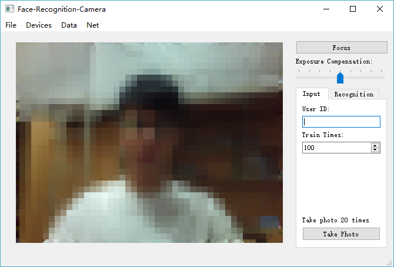

# BPNN-Face-Recognition-For-Qt

A Face Recognition System Based on BP(Back Propagation) Neural Network Developed by Qt.

Parallel Version：[Github . PAC-P2P/BPNN-Face-Recognition-For-Parallel](https://github.com/PAC-P2P/BPNN-Face-Recognition-For-Parallel)

Serial Version：[Github . PAC-P2P/BPNN-Face-Recognition](https://github.com/PAC-P2P/BPNN-Face-Recognition)

Qt Version：[Github . PAC-P2P/BPNN-Face-Recognition-For-Qt](https://github.com/PAC-P2P/BPNN-Face-Recognition-For-Qt)

## Usage

### Run

1. git clone https://github.com/PAC-P2P/BPNN-Face-Recognition-For-Qt.git

2. Use **Qt** to open `BPNN-Face-Recognition-For-Qt.pro`

3. Generate / Run

### Use

#### Train

1. Menu Bar - Net - Training
2. Enter Training times (Default 100 times)
3. OK (Start training)
4. Qt console prints training information, evaluation results, such as:

		Iteration number: 100
		Accuracy rate of: 74.359%
		Average error: 0.125675

5. Save to data/facenet.net
6. Successful train

#### Input Images

1. Input
2. Enter User ID (Unique)
3. Enter Train times (Default 100 times)
4. Take photo 20 times (Save to data\images\imagesTrain)
5. Train
6. Successful input

#### Recognition

1. Enter name (Optional)
2. Take Photo (Save to data\images\imagesRec\rec_01.pgm)
3. Train (if no facenet.net)
4. Recognition
5. Recognition result

## Warning

1. Images Size

	Make sure that the training set image has **the same image size** as the test set (including recognition).

	There are three sizes of images in `data\images`.

	* UserID_\*_1.pgm : 128 * 120
	* UserID_\*_2.pgm : 64 * 60
	* UserID_\*_3.pgm : 32 * 30

	If your camera is not of these sizes please delete it(Including modifying data/*.list) and enter your own photo.

2. User ID

	`User ID` must be **Unique**, otherwise it will overwrite user data.

3. Directory tree

	Please keep the following directory structure so that the program can run normally.

		.
		├── BPNN-Face-Recognition.pro
		├── Release
		│   └── BPNN-Face-Recognition.exe
		├── data
		│   ├── facenet.net
		│   ├── images
		│   │   ├── imagesRec
		│   │   │   └── rec_01.pgm
		│   │   └── imagesTrain
		│   │       ├── an2i_1_1.pgm
		│   │       ├── ...(images)
		│   │       └── cheyer_8_3.pgm
		│   ├── imagesSet_rec.list
		│   ├── imagesSet_testAll.list
		│   └── straightrnd_train.list
		└── src
    		├── backprop.cpp
    		├── backprop.h
    		├── camera.cpp
    		├── camera.h
    		├── camera.ui
    		├── dir.cpp
    		├── dir.h
    		├── facetrain.cpp
    		├── facetrain.h
    		├── imagenet.cpp
    		├── imagenet.h
    		├── imagesettings.cpp
    		├── imagesettings.h
    		├── imagesettings.ui
    		├── main.cpp
    		├── mainwindow.cpp
    		├── mainwindow.h
    		├── mainwindow.ui
    		├── pgmimage.cpp
    		├── pgmimage.h
    		├── src.pro
    		├── trainingsetting.cpp
    		├── trainingsetting.h
    		└── trainingsetting.ui

## Screenshots

## Data Set

[Neural Networks for Face Recognition](http://www.cs.cmu.edu/afs/cs.cmu.edu/user/mitchell/ftp/faces.html)

## License

[MIT](https://github.com/PAC-P2P/BPNN-Face-Recognition-For-Qt/blob/master/LICENSE)
